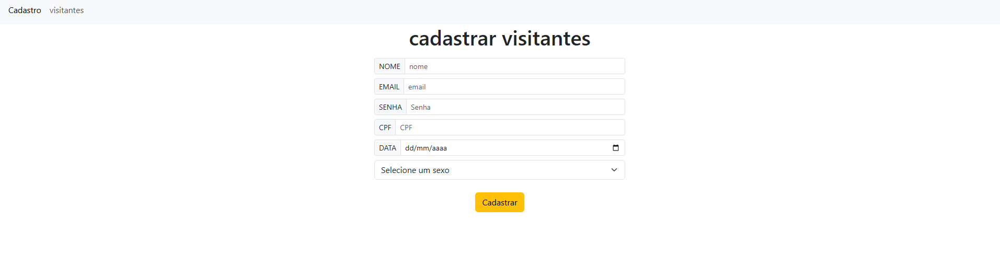
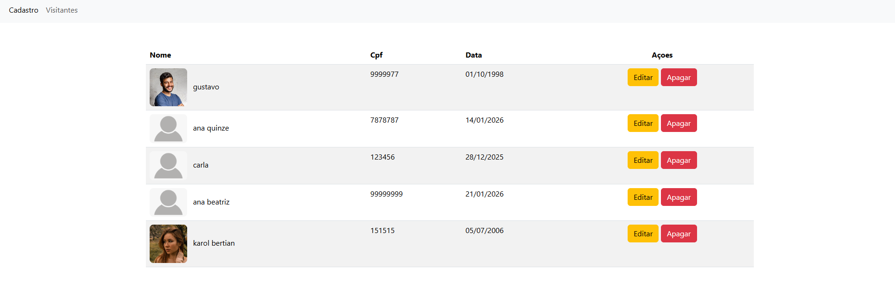

## cadastro visitantes

## Status: 🚧 
Em desenvolvimento

## Sobre
Este projeto consiste em um sistema simples de cadastro de usuários, desenvolvido com HTML, CSS e JavaScript no frontend e Node.js com MySQL no backend. A aplicação permite o envio e armazenamento de dados como nome, e-mail, senha, CPF, data e outras informações, contando com validações tanto no lado do cliente quanto no servidor.
No backend, as senhas são protegidas com hash utilizando bcrypt, garantindo maior segurança dos dados.

